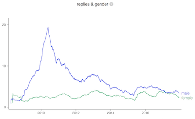

<h1>Welcome to the TwArχiv.</h1>

The [TwArχiv](http://twarxiv.org) is a *Twitter Archive Analyzer* that is designed to take in a complete *Twitter archive* as downloaded from Twitter.com and subsequently analyse it with respect to the number of tweets/replies etc. On the most basic level it displays how a persons tweeting frequency changes over time and how the proportion of tweets/retweets/replies changes over time.
The [TwArχiv](http://twarxiv.org) additionally tries to predict the gender of the people that a given user retweets and replies to, potentially uncovering unconscious bias when it comes to online interactions.
Furthermore, the [TwArχiv](http://twarxiv.org) uses the geolocation to display a Tweet-location and movement profile for the user.

## Usage / Installation
[TwArχiv](http://twarxiv.org) is a *Python* / *Django* application that has been designed to be deployed on *Heroku*. For the file storage and user management it interfaces with [Open Humans](https://openhumans.org) through *OAuth*. A deployed version can be seen live in action at [twarxiv.org](http://twarxiv.org). Read [the *INSTALL.md* for detailed installation instructions](https://github.com/gedankenstuecke/twitter-analyser/blob/master/INSTALL.md) 👍.

## Contributing
We are always happy about new contributors! [Open an issue](https://github.com/gedankenstuecke/twitter-analyser/issues) if you find a bug or have feature idea. If you want to contribute code please head to our *CONTRIBUTING.md*. Also: You have a larger feature/analysis idea that's not in TwArχiv yet? [Open Humans is giving out grants of up to $5,000](https://openhumans.org/grants) for projects that help to grow their eco-system that are a perfect match for this!
